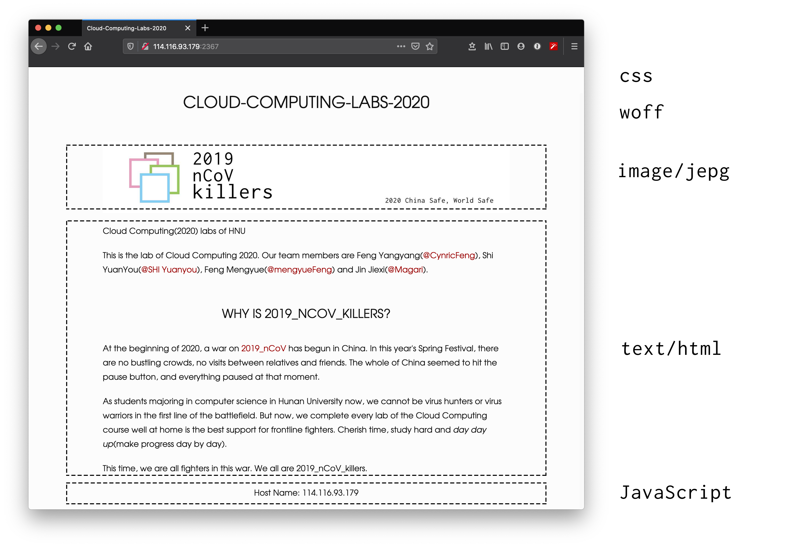
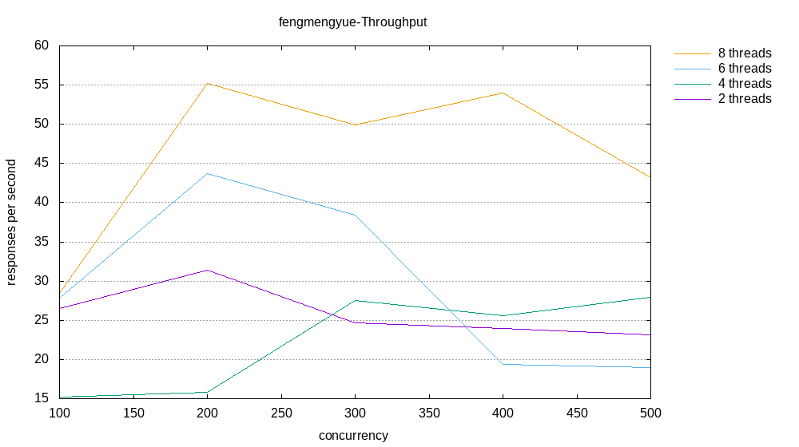
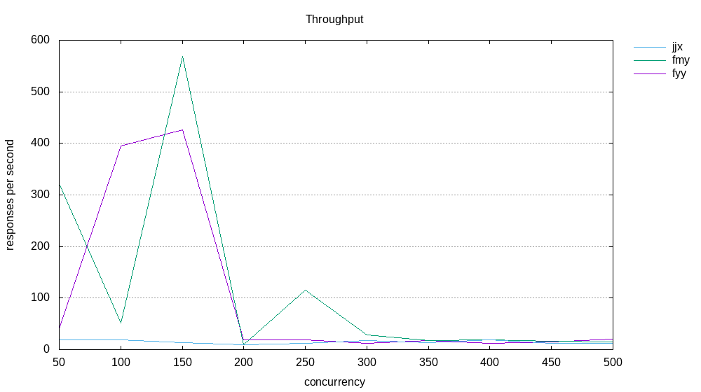
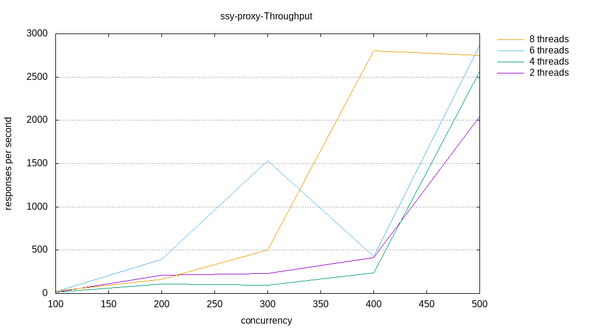

# Lab 2 Performance Report

*2019_nCoV_killers* 

## 实验内容

实现一个HTTP服务器，实验分为 basic 和 advanced 难度。

### 问题描述

从头开始构建基于 HTTP/1.1 的 HTTP 服务器。并通过高并发编程技巧来保证Web服务器的性能。

### 我们的工作

已经实现 advanced 级别，并且验证完毕，详细见正确性验证的部分。

### 其他说明

按照实验要求输入从而启动服务器，输入 quit 可以退出服务器。

## 测试

### 正确性测试

* 3.1.6：服务器可以根据给定的参数完成配置后运行。
* 3.1.7.1：web 浏览器访问服务器可以看到相关网页。
* 3.1.7.1.2：使用curl程序发送HTTP请求可以得到相应的响应报文。
* 3.1.7.1.3：果请求页面不存在，则HTTP服务器应返回404 Not Found错误消息
* 3.1.7.2.1：使用curl程序发送HTTP请求来检查POST方法是否有效，POST可以按要求运行。
* 3.1.7.2.2：如果请求URL不是`/Post_show`或键不是“名称”和“ ID”），则会收到404 Not Found错误消息。
* 3.1.7.3： 除GET请求和POST请求外，HTTP服务器将不处理HTTP请求。

### 性能测试

#### 测试方法

使用 HTTP 客户端测试工具 [ab-Apache HTTP服务器基准测试工具](http://httpd.apache.org/docs/current/programs/ab.html)。

测试了在不同的并发请求数、不同的客户请求数下：

1. 在不同的计算机环境上运行服务器时，不同线程数的服务器的情况；
2. 在多台计算机上运行客户端并同时访问另一台计算机上运行的服务端的情况；
3. 在代理模式下不同的计算机环境上运行服务器时，不同线程数，不同客户访问情况；

测试时使用的网站如下，包括css、woff、image/jepg和text/html：

#### 实验环境

|      |                     OS                     |                 CPU                 |         RAM          |
| :--: | :----------------------------------------: | :---------------------------------: | :------------------: |
| syy  | Ubuntu 18.04 bionic [Ubuntu on Windows 10] | Intel Core i7-7700HQ @ 8x 2.801 GHz | 7841 MiB / 12149 MiB |
| fyy  |            Ubuntu 18.04 bionic             |  Intel Xeon Gold 6161 @ 2x 2.2 Hz   | 1297 MiB / 3944 MiB  |
| fmy  |            Ubuntu 18.04 bionic             | Intel Core i7-7500U @ 4x 2.904 GHz  | 1537 MiB / 6071 MiB  |

*注：此处只标明了需要运行服务器的机器的环境，客户端的环境未标出。其中 fyy 为华为云服务器。fyy 的测试机器为 Mac OS。*

#### 2.2.3 性能分析

##### 测试一 不同的计算机环境上运行服务器时，不同线程数的服务器

在以下3台服务器环境下，不同的服务器线程数，不同的并发访问量，服务器每秒可以处理HTTP请求数如下图

可以看到在不不断增大的并发访问量下，服务器每秒可以处理HTTP请求数最后趋于一个极限，随着服务器线程数的增加，服务器的处理能力提高，但当并发访问过多时，超出服务器的处理能力也有可能会导致服务器每秒可以处理HTTP请求数下降。并且并发超过一定限度的同时，会导致大量拥塞，从而导致访问超时。由于虚拟机的缘故，服务器每秒可以处理HTTP请求数也有较大差异。

##### 测试二 多台计算机上运行客户端并同时访问另一台计算机上运行的服务端

分别在 jjx、fmy、fyy（Mac OS） 在本地运行客户端并同时使用公网 IP 访问 fyy 计算机（华为云）上运行的服务端，在不同的并发访问量下得到的服务器运行结果如下：

在高测试并发测试下，当总访问量在500左右时，服务器每秒可以处理HTTP请求数达到最高越1000，但是当访问量继续增大，则造成服务器性能急剧下降。

##### 测试三 代理模式下不同的计算机环境上运行服务器时，不同线程数

在 syy 的机器上使用代理（代理 fyy 的华为云服务器的相同 HTTP Server）时，不同的服务器线程数，不同的并发访问量，服务器每秒可以处理HTTP请求数如下图：

与不使用代理时服务器每秒可以处理HTTP请求数的变化类似，但是在高并发访问量的时候，相比不使用代理会造成更高的丢包率，更高的丢包会导致服务器看似每秒处理HTTP请求数增高，但根据低并发访问量的情况来看，还是在不使用代理时更快一些。

